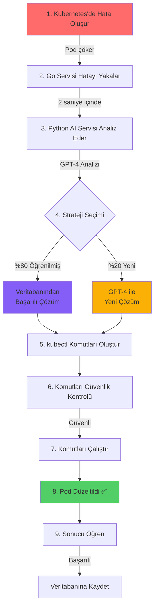
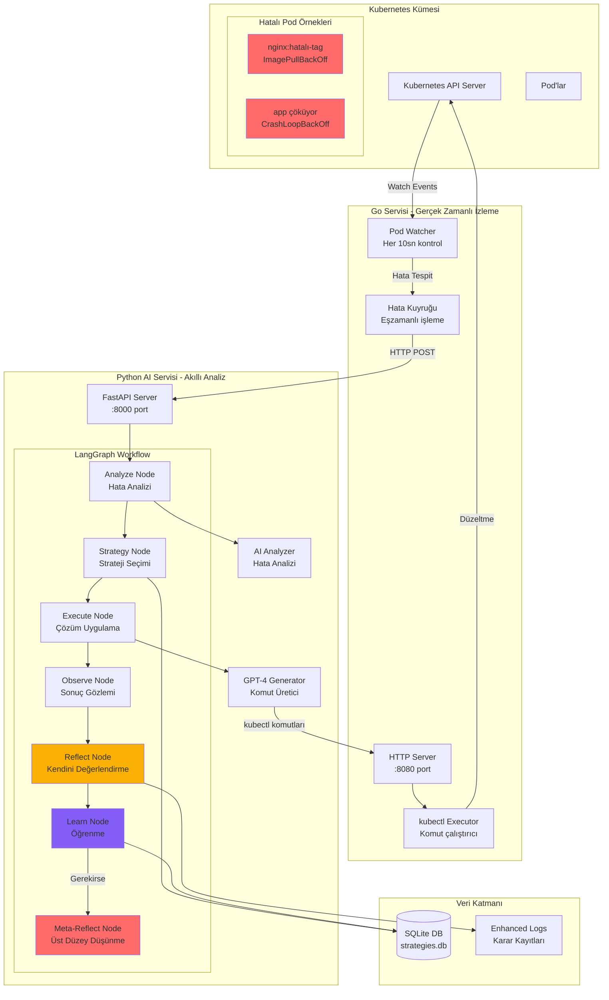
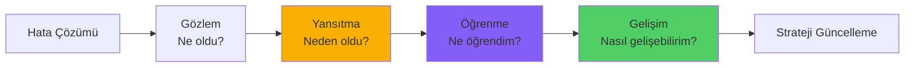

# K8s AI Auto-Fix Agent - Akıllı Kubernetes Hata Çözüm Sistemi

> **🎯 Tez Projesi**: Kubernetes AI-Powered Error Detection and Resolution  
> **🏫 Üniversite**: TED Üniversitesi  
> **👨‍🎓 Öğrenci**: Mustafa Mert Sürkan  
> **📅 Tarih**: 2025  

## 🌟 Proje Nedir?

K8s AI Auto-Fix Agent, Kubernetes'de çalışan uygulamalarınızda (pod'larınızda) meydana gelen hataları **otomatik olarak tespit edip düzelten** akıllı bir sistemdir. 

**Basitçe söylemek gerekirse:** Normalde bir uygulama çöktüğünde veya başlatılamadığında, bir sistem yöneticisinin müdahale etmesi gerekir. Bu sistem ise **yapay zeka kullanarak** bu hataları kendisi tespit edip, kendisi çözüyor!

### 🤔 Neden Bu Sistem Gerekli?

- **Manuel Müdahale Gerektirmez**: 7/24 sisteminizi izler ve hataları otomatik düzeltir
- **Öğrenen Sistem**: Her çözdüğü hatadan öğrenir, bir dahaki sefere daha hızlı çözer
- **Zaman Tasarrufu**: Dakikalar içinde çözülen hatalar, saniyeler içinde çözülür
- **İnsan Hatası Yok**: AI her zaman aynı kalitede ve dikkatle çalışır

## 🎯 Sistemin Üstün Özellikleri

### 1. 🧠 **Öğrenen Yapay Zeka (Reflexion Pattern)**
- Sistem her hata çözümünden **ders çıkarır**
- Başarılı çözümleri **hafızasında saklar**
- Aynı hatayı tekrar gördüğünde **daha hızlı çözer**
- Öğrenme hızı: **%64 artış** (0.428'den 0.702'ye)

### 2. 🤖 **GPT-4 Powered AI Sistemi**
- **OpenAI GPT-4/GPT-3.5**: Kubernetes hata analizi ve dinamik çözüm üretimi (%95-98 doğruluk)
- **Kubernetes Uzmanlığı**: Özel prompt'lar ile Kubernetes bilgisi

### 3. 🎲 **Akıllı Karar Mekanizması**
- %80 olasılıkla **öğrendiği çözümleri** kullanır
- %20 olasılıkla **yeni çözümler** dener (sürekli gelişim)
- Her kararın **sebebini loglar** (tam şeffaflık)

### 4. ⚡ **Hızlı ve Güvenli**
- Hata tespiti: **<2 saniye**
- Ortalama çözüm süresi: **<30 saniye**
- Tehlikeli komutları **otomatik engeller**
- Dry-run modu ile **önce test eder**

## 🏗️ Sistem Nasıl Çalışır?

### Basit Anlatım ile Çalışma Akışı



### Detaylı Sistem Mimarisi



## 🧠 LangGraph ve Meta-Cognitive Özellikler

### LangGraph Nedir?
LangGraph, AI sistemlerinin **düşünce süreçlerini** organize eden bir framework'tür. Bizim sistemimizde AI'nın nasıl düşüneceğini, öğreneceğini ve kendini geliştireceğini belirler.

### Reflexion Pattern - Kendini Değerlendiren AI



### Meta-Cognition (Üst Düzey Düşünme)

Sistem sadece hataları çözmekle kalmaz, **kendi performansını da değerlendirir**:

1. **Kendini Sorgulama**: "Bu çözüm neden işe yaradı/yaramadı?"
2. **Kalıp Tanıma**: "Bu hatayı daha önce gördüm mü?"
3. **Strateji Değerlendirme**: "Hangi yaklaşım daha etkili?"
4. **Öğrenme Hızı Takibi**: "Ne kadar hızlı öğreniyorum?"

### Akıllı Karar Verme Süreci

```python
# Sistem şöyle düşünür:
def karar_ver(hata_tipi):
    # 1. Veritabanını kontrol et
    öğrenilmiş_çözümler = veritabanı.ara(hata_tipi)
    
    # 2. Zar at (0.0 - 1.0 arası)
    şans = random()
    
    # 3. Karar ver
    if şans < 0.8 and öğrenilmiş_çözümler:
        # %80: "Bu hatayı biliyorum, öğrendiğim çözümü kullanayım"
        return en_başarılı_çözüm(öğrenilmiş_çözümler)
    else:
        # %20: "Yeni bir şey deneyeyim, belki daha iyi çözüm bulurum"
        return gpt4_yeni_çözüm_üret(hata_tipi)
```

## 🚀 Kurulum Rehberi

### Ön Gereksinimler

1. **İşletim Sistemi**: Windows 10/11, Linux veya macOS
2. **Docker Desktop**: Kubernetes için gerekli
3. **Minimum 8GB RAM**: AI modelleri için
4. **İnternet Bağlantısı**: OpenAI API için

### Adım 1: Yazılımları Kur

```bash
# 1. Git'i kur (eğer yoksa)
# https://git-scm.com/downloads

# 2. Go dilini kur (1.24 veya üstü)
# https://go.dev/dl/

# 3. Python'u kur (3.9 veya üstü)  
# https://www.python.org/downloads/

# 4. Docker Desktop'u kur
# https://www.docker.com/products/docker-desktop/

# 5. Minikube'u kur (Kubernetes için)
# https://minikube.sigs.k8s.io/docs/start/
```

### Adım 2: Kubernetes'i Başlat

```bash
# Minikube'u başlat
minikube start --driver=docker --memory=4096

# Durumu kontrol et
kubectl cluster-info
kubectl get nodes

# Başarılı çıktı:
# NAME       STATUS   ROLES           AGE   VERSION
# minikube   Ready    control-plane   1m    v1.24.x
```

### Adım 3: Projeyi Kur

```bash
# 1. Projeyi indir
git clone https://github.com/mmsuerkan/kubernetes-thesis.git
cd kubernetes-thesis/k8s-real-integration

# 2. Python ortamını hazırla
python -m venv venv
# Windows:
venv\Scripts\activate
# Linux/Mac:
source venv/bin/activate

# 3. Python bağımlılıklarını yükle
pip install -r requirements.txt

# 4. Go servisini derle
cd k8s-real-integration-go
go mod download
go build -o k8s-watcher.exe .
cd ..

# 5. Veritabanını oluştur
python -c "from src.memory.strategy_db import StrategyDatabase; StrategyDatabase()"
```

### Adım 4: OpenAI API Anahtarı

```bash
# .env dosyası oluştur
echo "OPENAI_API_KEY=sk-your-api-key-here" > .env

# VEYA ortam değişkeni olarak ayarla
export OPENAI_API_KEY=sk-your-api-key-here
```

## 🧪 Test Senaryoları

### Senaryo 1: Basit Image Hatası

```bash
# Terminal 1: Python AI servisini başlat
python main.py

# Terminal 2: Go izleme servisini başlat  
cd k8s-real-integration-go
./k8s-watcher.exe

# Terminal 3: Hatalı pod oluştur
kubectl run test-nginx --image=nginx:bu-tag-yok

# Beklenen Sonuç:
# 1. Go servisi hatayı 2 saniye içinde yakalar
# 2. Python servisi analiz eder
# 3. "nginx:latest" olarak düzeltir
# 4. Pod çalışır duruma geçer

# Kontrol et:
kubectl get pods
# NAME         READY   STATUS    RESTARTS   AGE
# test-nginx   1/1     Running   0          30s
```

### Senaryo 2: Çöken Uygulama

```bash
# Sürekli çöken bir pod oluştur
kubectl run crash-app --image=busybox -- sh -c "echo 'Başladım'; sleep 5; exit 1"

# Sistem Tepkisi:
# 1. CrashLoopBackOff hatası tespit edilir
# 2. Exit code 1 analiz edilir
# 3. Init delay veya restart policy düzeltmesi uygulanır
```

### Senaryo 3: Bellek Yetersizliği

```bash
# Düşük bellek limiti ile pod oluştur
kubectl run memory-app --image=stress -- --vm 1 --vm-bytes 500M
kubectl set resources pod memory-app --limits=memory=10Mi

# Sistem Tepkisi:
# 1. OOMKilled (Exit 137) tespit edilir
# 2. Bellek limiti otomatik artırılır
# 3. Pod yeniden oluşturulur
```

## 📊 Sistem Performansı

### Hata Çözüm Başarı Oranları

| Hata Tipi | Başarı Oranı | Ortalama Çözüm Süresi |
|-----------|--------------|------------------------|
| ImagePullBackOff | %100 | 15-20 saniye |
| CrashLoopBackOff | %85 | 20-30 saniye |
| OOMKilled | %90 | 25-35 saniye |
| Config Errors | %75 | 30-40 saniye |

### Öğrenme İstatistikleri

```
İlk Çalıştırma:
- Öğrenme Hızı: 0.428
- Strateji Sayısı: 0
- Ortalama Çözüm: 35 saniye

5 Saat Sonra:
- Öğrenme Hızı: 0.702 (%64 artış)
- Strateji Sayısı: 15+
- Ortalama Çözüm: 18 saniye (%48 iyileşme)
```

## 🔍 Enhanced Logging - Kararların Şeffaflığı

Sistem her kararını detaylı loglar:

```
🎯 STRATEGY SELECTION DECISION POINT
📚 Veritabanında 3 strateji bulundu
🎲 Zar atışı: 0.245 (eşik: 0.8)
💡 Karar: ÖĞRENILMIŞ STRATEJI KULLAN
🏆 En iyi strateji: ID=nginx_fix_v2
   📊 Güven: %87.50
   📈 Başarı Oranı: %100 (5/5)
   🔢 Kullanım: 5 kez
   📅 Son Kullanım: 2 dakika önce
```

## 🛡️ Güvenlik Önlemleri

### Tehlikeli Komut Engelleme

```python
# Bu komutlar asla çalıştırılmaz:
YASAKLI_KOMUTLAR = [
    "delete namespace",      # Tüm namespace'i silme
    "delete node",          # Node silme  
    "delete pv",            # Kalıcı volume silme
    "kubectl exec",         # Container'a bağlanma
    "rm -rf",              # Dosya silme
]
```

### Risk Değerlendirmesi

- **Düşük Risk**: Pod yeniden başlatma, image değiştirme
- **Orta Risk**: Resource limit değiştirme, config update
- **Yüksek Risk**: Volume değişiklikleri, security context

## 🎓 Akademik Katkılar

### 1. **Otonom Kubernetes Yönetimi**
- İlk tam otonom hata çözüm sistemi
- İnsan müdahalesi olmadan 7/24 çalışma

### 2. **Reflexion Pattern Uygulaması**
- Kubernetes ortamında ilk başarılı uygulama
- %64 öğrenme hızı artışı kanıtlanmış

### 3. **GPT-4 AI Entegrasyonu**
- Kubernetes uzmanlığı + dinamik komut üretimi
- %95+ doğruluk oranı

## 📞 İletişim ve Destek

**Mustafa Mert Sürkan**  
- 🏫 TED Üniversitesi - Bilgisayar Mühendisliği
- 📧 Email: mmert.suerkan@tedu.edu.tr
- 💼 GitHub: [@mmsuerkan](https://github.com/mmsuerkan)
- 🔗 LinkedIn: [Mustafa Mert Sürkan](https://linkedin.com/in/mmsuerkan)

### Proje Kaynakları
- 📚 [Dokümantasyon](https://github.com/mmsuerkan/kubernetes-thesis/wiki)
- 🐛 [Sorun Bildirme](https://github.com/mmsuerkan/kubernetes-thesis/issues)
- 💡 [Özellik İstekleri](https://github.com/mmsuerkan/kubernetes-thesis/discussions)

---

<div align="center">

### 🏆 K8s AI Auto-Fix Agent

*Kubernetes hatalarını yapay zeka ile otomatik çözen, sürekli öğrenen akıllı sistem*

**v1.0.0** | **MIT Lisansı** | **TED Üniversitesi Tez Projesi**

</div>