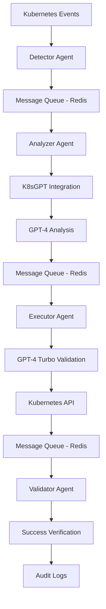

# Sistem Mimarisi Analizi

**Proje:** K8s AI Auto-Fix Agent  
**Tarih:** 30 Haziran 2025  
**Analiz Türü:** Architecture Deep Dive  

---

## 🏗️ **Mimari Genel Bakış**

### **4-Katmanlı Agent Mimarisi**



---

## 🔍 **Agent Detay Analizi**

### **1. Detector Agent - Event Watcher**

#### **Sorumluluklar**
- Kubernetes API Server'dan event stream'i dinler
- Pod crash/failure event'lerini filtreler
- Anomali detection algoritmaları uygular
- Message queue'ya structured event data gönderir

#### **Teknik Implementasyon**
```go
// Örnek kod yapısı
type DetectorAgent struct {
    clientset    kubernetes.Interface
    eventQueue   EventQueue
    watchOptions metav1.ListOptions
}

func (d *DetectorAgent) WatchEvents() {
    watcher, err := d.clientset.CoreV1().Events("").Watch(d.watchOptions)
    for event := range watcher.ResultChan() {
        if d.isRelevantEvent(event) {
            d.eventQueue.Publish(event)
        }
    }
}
```

#### **Teknoloji Stack**
- **client-go**: Kubernetes API client
- **Watch API**: Real-time event streaming
- **Redis Go Client**: Message queue integration
- **Gin/Echo**: REST API endpoints

#### **Performans Hedefleri**
- **Event Processing**: 1000+ events/saniye
- **Latency**: <50ms event detection
- **Memory Usage**: <256MB
- **CPU Usage**: <100m (0.1 core)

---

### **2. Analyzer Agent - AI Brain**

#### **Sorumluluklar**
- Event queue'dan crash event'lerini alır
- K8sGPT binary ile hata analizi yapar
- GPT-4 ile root cause analysis
- Structured analysis results üretir

#### **AI Integration Flow**
```
Event Data → K8sGPT Binary → GPT-4 API → Analysis Results
```

#### **Teknik Implementasyon**
```go
type AnalyzerAgent struct {
    k8sgptBinary string
    openaiClient *openai.Client
    messageQueue MessageQueue
}

func (a *AnalyzerAgent) AnalyzeEvent(event Event) {
    // K8sGPT çalıştır
    analysis := a.runK8sGPT(event)
    
    // GPT-4 ile derinlemesine analiz
    insights := a.openaiClient.Analyze(analysis)
    
    // Results'ı Executor'a gönder
    a.messageQueue.Publish("executor-queue", insights)
}
```

#### **AI Model Stratejisi**
- **Primary Model**: GPT-4 (complex analysis için)
- **Fallback**: GPT-3.5-turbo (cost optimization)
- **Context Window**: 8K tokens
- **Response Format**: Structured JSON

#### **K8sGPT Integration**
```bash
# K8sGPT komut örneği
./k8sgpt.exe analyze --namespace=default --explain --output=json
```

---

### **3. Executor Agent - Action Taker**

#### **Sorumluluklar**
- Analysis results'ı alır
- GPT-4 Turbo ile command safety validation
- Kubernetes API calls ile otomatik düzeltme
- Dry-run mode support

#### **Safety Validation Flow**
```
Analysis → GPT-4 Turbo Safety Check → Command Generation → API Execution
```

#### **Teknik Implementasyon**
```go
type ExecutorAgent struct {
    kubeClient   kubernetes.Interface
    safetyAI     *openai.Client
    dryRunMode   bool
}

func (e *ExecutorAgent) ExecuteFix(analysis Analysis) {
    // Safety validation
    if !e.validateSafety(analysis) {
        return errors.New("unsafe operation")
    }
    
    // Command generation
    command := e.generateCommand(analysis)
    
    // Execute with dry-run first
    if err := e.dryRunCommand(command); err != nil {
        return err
    }
    
    // Real execution
    return e.executeCommand(command)
}
```

#### **Safety Mechanisms**
- **GPT-4 Turbo Risk Assessment**: Her komut için güvenlik analizi
- **Dry-run Mode**: Risk-free testing
- **Rollback Capability**: Automatic reversion
- **Circuit Breaker**: Repeated failure protection

#### **Supported Fix Categories**
1. **Image Pull Errors**: Tag correction, registry auth
2. **Resource Issues**: Memory/CPU limit adjustment
3. **Configuration Errors**: ConfigMap/Secret fixes
4. **Network Problems**: Service/Ingress repairs
5. **Storage Issues**: PVC expansion

---

### **4. Validator Agent - Quality Assurance**

#### **Sorumluluklar**
- Fix execution sonrası verification
- Pod/service health check
- GPT-4 Turbo ile success evaluation
- Rollback decision making

#### **Validation Process**
```
Fix Applied → Grace Period → Health Check → AI Evaluation → Report
```

#### **Teknik Implementasyon**
```go
type ValidatorAgent struct {
    kubeClient   kubernetes.Interface
    evaluationAI *openai.Client
    auditLogger  AuditLogger
}

func (v *ValidatorAgent) ValidateFix(fixResult FixResult) {
    // Grace period wait
    time.Sleep(30 * time.Second)
    
    // Health check
    health := v.checkResourceHealth(fixResult.Resource)
    
    // AI evaluation
    success := v.evaluationAI.EvaluateSuccess(health, fixResult.Expected)
    
    // Audit logging
    v.auditLogger.Log(AuditEntry{
        Timestamp: time.Now(),
        Success:   success,
        Details:   fixResult,
    })
    
    // Rollback if failed
    if !success {
        v.rollbackFix(fixResult)
    }
}
```

#### **Validation Criteria**
- **Pod Status**: Running state achieved
- **Resource Utilization**: Within expected limits
- **Error Logs**: No new errors generated
- **Service Connectivity**: Endpoints reachable

---

## 🔗 **Message Queue Architecture**

### **Redis Streams Implementation**

#### **Queue Topics**
```yaml
Topics:
  crash-events:
    source: Detector Agent
    target: Analyzer Agent
    format: {"namespace": "default", "pod": "web-app", "error": "ImagePullBackOff"}
    
  analysis-results:
    source: Analyzer Agent
    target: Executor Agent
    format: {"analysis": "Image not found", "solution": "update-image-tag", "confidence": 0.95}
    
  execution-results:
    source: Executor Agent
    target: Validator Agent
    format: {"command": "kubectl patch...", "timestamp": "2024-01-01T10:30:00Z", "applied": true}
    
  validation-results:
    source: Validator Agent
    target: System Logs
    format: {"status": "success", "duration": "45s", "pod_status": "Running"}
```

#### **Message Durability**
- **Persistence**: Redis AOF enabled
- **Retry Logic**: 3x retry with exponential backoff
- **Dead Letter Queue**: Failed messages isolation
- **Monitoring**: Queue depth ve latency tracking

#### **Performance Specifications**
- **Throughput**: 1000+ messages/saniye
- **Latency**: <100ms message delivery
- **Memory Usage**: <2GB Redis instance
- **Durability**: 99.9% message persistence

---

## 🛠️ **Kubernetes Native Integration**

### **Custom Resource Definitions (CRDs)**

#### **AutoFixPolicy CRD**
```yaml
apiVersion: apiextensions.k8s.io/v1
kind: CustomResourceDefinition
metadata:
  name: autofixpolicies.k8sgpt.ai
spec:
  group: k8sgpt.ai
  versions:
  - name: v1
    served: true
    storage: true
    schema:
      openAPIV3Schema:
        type: object
        properties:
          spec:
            type: object
            properties:
              autoFixEnabled:
                type: object
                properties:
                  ImagePullBackOff:
                    type: boolean
                  OOMKilled:
                    type: boolean
                  CrashLoopBackOff:
                    type: boolean
              riskLevel:
                type: string
                enum: ["low", "medium", "high"]
              approvalRequired:
                type: boolean
              rollbackTimeout:
                type: string
                default: "300s"
  scope: Namespaced
```

#### **Operator Pattern Implementation**
```go
type AutoFixController struct {
    kubeclientset kubernetes.Interface
    sampleclientset clientset.Interface
    deploymentsLister appslisters.DeploymentLister
    deploymentsSynced cache.InformerSynced
    workqueue workqueue.RateLimitingInterface
    recorder record.EventRecorder
}

func (c *AutoFixController) Run(threadiness int, stopCh <-chan struct{}) error {
    defer utilruntime.HandleCrash()
    defer c.workqueue.ShutDown()

    // Start the informer factories to begin populating the informer caches
    klog.Info("Starting AutoFix controller")

    // Wait for the caches to be synced before starting workers
    klog.Info("Waiting for informer caches to sync")
    if ok := cache.WaitForCacheSync(stopCh, c.deploymentsSynced); !ok {
        return fmt.Errorf("failed to wait for caches to sync")
    }

    klog.Info("Starting workers")
    for i := 0; i < threadiness; i++ {
        go wait.Until(c.runWorker, time.Second, stopCh)
    }

    klog.Info("Started workers")
    <-stopCh
    klog.Info("Shutting down workers")

    return nil
}
```

---

## 🔐 **Security Architecture**

### **RBAC Configuration**
```yaml
apiVersion: rbac.authorization.k8s.io/v1
kind: ClusterRole
metadata:
  name: k8s-ai-autofix
rules:
- apiGroups: [""]
  resources: ["pods", "services", "configmaps", "secrets"]
  verbs: ["get", "list", "watch", "patch", "update"]
- apiGroups: ["apps"]
  resources: ["deployments", "replicasets"]
  verbs: ["get", "list", "watch", "patch", "update"]
- apiGroups: ["events.k8s.io"]
  resources: ["events"]
  verbs: ["get", "list", "watch"]
---
apiVersion: rbac.authorization.k8s.io/v1
kind: ClusterRoleBinding
metadata:
  name: k8s-ai-autofix
roleRef:
  apiGroup: rbac.authorization.k8s.io
  kind: ClusterRole
  name: k8s-ai-autofix
subjects:
- kind: ServiceAccount
  name: k8s-ai-autofix
  namespace: k8s-ai-system
```

### **Network Security**
```yaml
apiVersion: networking.k8s.io/v1
kind: NetworkPolicy
metadata:
  name: k8s-ai-autofix-netpol
spec:
  podSelector:
    matchLabels:
      app: k8s-ai-autofix
  policyTypes:
  - Ingress
  - Egress
  ingress:
  - from:
    - namespaceSelector:
        matchLabels:
          name: k8s-ai-system
    ports:
    - protocol: TCP
      port: 8080
  egress:
  - to: []
    ports:
    - protocol: TCP
      port: 443  # OpenAI API
    - protocol: TCP
      port: 6379 # Redis
    - protocol: TCP
      port: 8443 # Kubernetes API
```

---

## 📊 **Performance & Scalability**

### **Scalability Design**

#### **Horizontal Scaling**
```yaml
apiVersion: apps/v1
kind: Deployment
metadata:
  name: analyzer-agent
spec:
  replicas: 3  # Horizontal scaling
  template:
    spec:
      containers:
      - name: analyzer
        resources:
          requests:
            memory: "256Mi"
            cpu: "100m"
          limits:
            memory: "512Mi"
            cpu: "500m"
```

#### **Auto-scaling Configuration**
```yaml
apiVersion: autoscaling/v2
kind: HorizontalPodAutoscaler
metadata:
  name: analyzer-agent-hpa
spec:
  scaleTargetRef:
    apiVersion: apps/v1
    kind: Deployment
    name: analyzer-agent
  minReplicas: 2
  maxReplicas: 10
  metrics:
  - type: Resource
    resource:
      name: cpu
      target:
        type: Utilization
        averageUtilization: 70
  - type: Resource
    resource:
      name: memory
      target:
        type: Utilization
        averageUtilization: 80
```

### **Performance Benchmarks**

| **Metric** | **Target** | **Current** | **Monitoring** |
|------------|------------|-------------|----------------|
| **Event Processing** | 1000/sec | TBD | Prometheus metrics |
| **Fix Latency** | <10sec | TBD | Custom metrics |
| **Success Rate** | >90% | TBD | Audit logs |
| **System Uptime** | 99.9% | TBD | Health checks |

---

## 🚀 **Deployment Architecture**

### **Helm Chart Structure**
```
helm/
├── Chart.yaml
├── values.yaml
├── templates/
│   ├── detector-deployment.yaml
│   ├── analyzer-deployment.yaml
│   ├── executor-deployment.yaml
│   ├── validator-deployment.yaml
│   ├── redis-statefulset.yaml
│   ├── services.yaml
│   ├── configmaps.yaml
│   ├── secrets.yaml
│   ├── rbac.yaml
│   └── crds/
│       └── autofixpolicy-crd.yaml
```

### **Multi-Environment Support**
```yaml
# values-dev.yaml
global:
  environment: development
  
analyzer:
  replicas: 1
  aiModel: "gpt-3.5-turbo"  # Cost optimization
  
executor:
  dryRunOnly: true  # Safety for dev

# values-prod.yaml
global:
  environment: production
  
analyzer:
  replicas: 3
  aiModel: "gpt-4"  # Best performance
  
executor:
  dryRunOnly: false
  approvalRequired: true  # Human oversight
```

---

## 🎯 **Mimari Değerlendirme Sonucu**

### **Güçlü Yönler** ✅
1. **Modern Microservices Architecture**: Agent-based design
2. **Kubernetes-Native Integration**: CRDs, Operators, RBAC
3. **Event-Driven Architecture**: Scalable ve responsive
4. **Comprehensive Security**: Multi-layer protection
5. **Observability**: Built-in monitoring ve logging

### **Potansiyel İyileştirmeler** 🔄
1. **Caching Layer**: Frequently accessed data için
2. **Circuit Breaker Pattern**: Enhanced reliability
3. **Blue-Green Deployment**: Zero-downtime updates
4. **Multi-Region Support**: Geographic distribution

### **Mimari Olgunluk Skoru: 9/10**

Bu mimari **enterprise-grade** bir sistem için uygun ve modern best practice'leri takip ediyor. Implementation quality'si yüksek olduğunda çok başarılı bir sistem olacak.

---

**Doküman Sahibi:** Architecture Team  
**Son Güncelleme:** 30 Haziran 2025  
**Versiyon:** 1.0